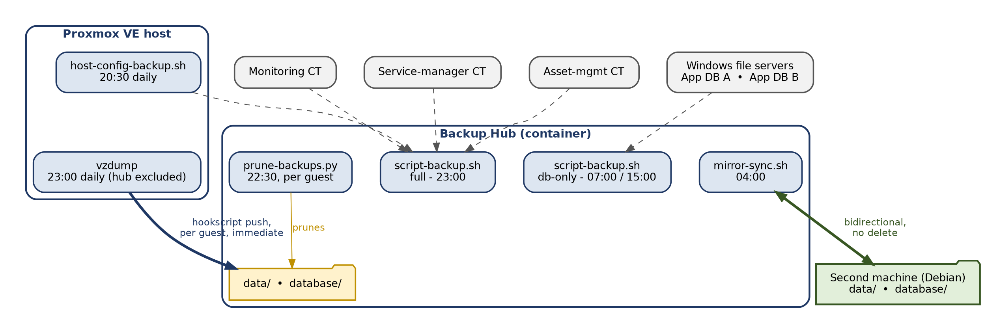
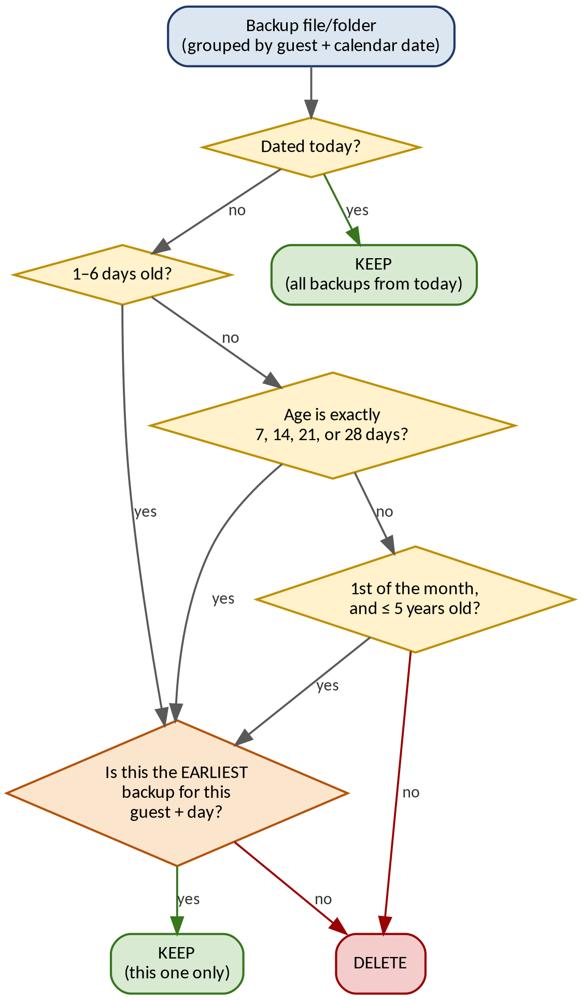
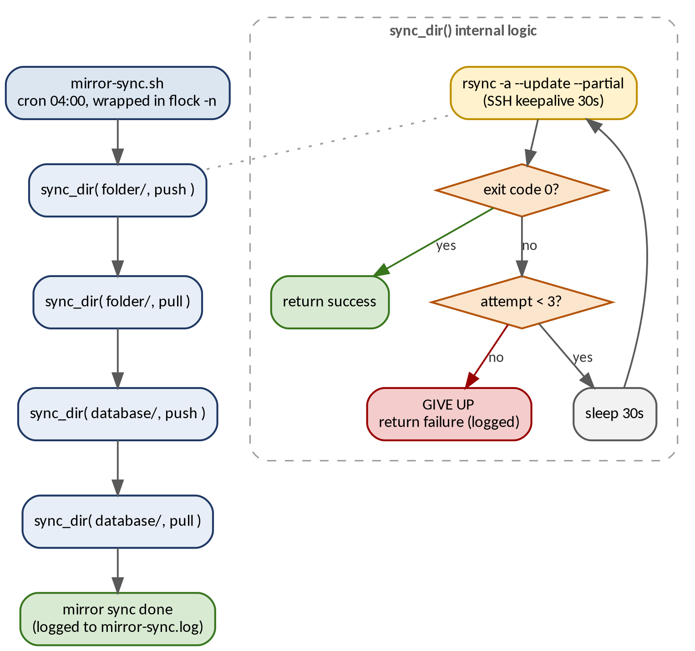

# Centralized Backup Infrastructure for a Proxmox Environment

**One place to check every backup. Automated retention, a two-machine mirror, and a pipeline where every backup script is itself backed up.**


---

## Contents

1. [Summary](#summary)
2. [The Problem](#the-problem)
3. [Objectives](#objectives)
4. [Architecture](#architecture)
5. [Daily Schedule](#daily-schedule)
6. [Pipeline Details](#pipeline-details)
7. [Retention Policy](#retention-policy)
8. [Second-Machine Mirror](#second-machine-mirror)
9. [Security](#security)
10. [Design Decisions and Rejected Alternatives](#design-decisions-and-rejected-alternatives)
11. [Self-Backup: No Single Point of Failure](#self-backup-no-single-point-of-failure)
12. [Verification Audit](#verification-audit)
13. [Status, Limitations and Roadmap](#status-limitations-and-roadmap)
14. [Restoring a Container](#restoring-a-container)
15. [Skills Demonstrated](#skills-demonstrated)
16. [Related Projects](#related-projects)

---

## Summary

| | |
|---|---|
| **What** | A central **Backup Hub** that collects every backup source in one place, applies one retention policy, and mirrors itself to a second machine. |
| **Sources** | All VMs and containers (vzdump), the Proxmox host configuration, Windows file-server data, a monitoring stack archive, and container Compose files. |
| **Approach** | Proxmox **pushes** big VM/CT archives right after each backup. The Hub **pulls** everything else on its own schedule. |
| **Retention** | Tiered (daily → weekly → monthly, up to 5 years), applied **per guest, per day**. |
| **Redundancy** | Bidirectional mirror to a second machine, with no deletion in either direction. |
| **Hardening** | No plaintext credentials in scripts. Dedicated SSH keys per direction. |
| **First mirror run** | About 211 GB moved in about 2 h 45 min. |

---

## The Problem

Before this project, backups were **several independent, uncoordinated processes**:

- Proxmox's own local vzdump storage (small capacity)
- A separate cron job on the monitoring container
- A standalone script pulling Windows databases

There was **no single place** to confirm that the organization's backups were healthy, and **no consistent retention policy** across sources.

---

## Objectives

1. **Consolidate** every backup source into one central location (the "Hub").
2. Apply **one consistent, storage-aware retention policy** to all backup types.
3. **Remove single points of failure in the backup process itself.** Every script that makes a backup is backed up by another part of the system.
4. **Eliminate plaintext credentials** from automation scripts.
5. Add **second-machine redundancy** through a bidirectional mirror.

---

## Architecture



| Arrow | Meaning |
|---|---|
| **Solid, bold** | Immediate, per-guest push from Proxmox (vzdump hookscript) |
| **Dashed** | Scheduled rsync / CIFS pull started by the Hub |
| **Green, double-headed** | Bidirectional mirror, the only sync with no delete in either direction |

### Why push for VMs/CTs and pull for everything else?

Proxmox's local disk is only about **100 GB**, far smaller than all guest backups combined. If Proxmox wrote everything locally and waited for the Hub to collect it, the disk would overflow.

By **pushing each archive and deleting it locally right after it is created**, peak local usage stays near the size of the *single largest guest*, not the sum of all guests.

Everything else (host config, monitoring archive, Windows data, Compose files) is small, so the Hub **pulls** it on its own schedule. This keeps the pull logic in one script on the Hub side.

---

## Daily Schedule

| Time | Job | Runs on |
|---|---|---|
| 07:00 | `script-backup.sh db-only` (the two Windows databases) | Hub |
| 15:00 | `script-backup.sh db-only` | Hub |
| 20:30 | `host-config-backup.sh` (Proxmox config archive) | Proxmox |
| 22:30 | `prune-backups.py` (tiered retention) | Hub, **and** second machine |
| 23:00 | `vzdump` (all VMs/CTs, once daily) | Proxmox |
| 23:00 | `script-backup.sh full` (databases + host config + monitoring + self-backup + logs) | Hub |
| 04:00 | `mirror-sync.sh` (bidirectional sync) | Hub ↔ second machine |

**Two ordering rules matter:**

- **Prune before mirror.** Both machines prune at 22:30, and the mirror runs at 04:00. If the mirror ran first, a file deleted on one side could be copied back from the other (see [Retention coordination](#why-both-sides-must-prune)).
- **vzdump and the full collection both start at 23:00.** A full vzdump run can take up to about 3 hours. This works because the hookscript pushes each archive out as soon as that guest finishes, so the two jobs don't need to run strictly one after the other.

---

## Pipeline Details

### 1. VM/CT backups: vzdump plus a hookscript

```ini
# /etc/pve/jobs.cfg (sanitized)
vzdump: backup-job-1
    schedule 23:00
    all 1
    compress zstd
    mode snapshot
    exclude <HUB_CTID>
    prune-backups keep-last=1
    script /var/lib/vz/snippets/hub-push.sh
    storage local
```

| Setting | Why |
|---|---|
| `all 1` | Every VM/CT is included automatically. A new guest needs **zero manual setup**. |
| `exclude <HUB_CTID>` | The Hub is excluded so it doesn't back up its own backup folder (a recursion). |
| `keep-last=1` | Proxmox's local copy is only a short staging buffer. The hookscript deletes it after a successful push. |
| `storage local` | Small local disk as staging. An NFS design was tested and rejected (see [decisions](#design-decisions-and-rejected-alternatives)). |

The hookscript `hub-push.sh` runs at two phases for each guest:

- **`backup-end`:** push the finished archive to the Hub (into a per-guest folder), then delete the local copy **only if the push succeeded**.
- **`log-end`:** push that guest's log file, then delete it locally.

```bash
#!/bin/bash
HUB_USER="root"; HUB_HOST="10.0.1.10"
HUB_PATH="/srv/backup/data"; LOG="/var/log/hub-push.log"

case "$1" in
  backup-end)
    VMID="$3"; ARCHIVE="$TARGET"
    case "$VMTYPE" in
      qemu) DEST="$HUB_PATH/vm/$VMID/" ;;
      lxc)  DEST="$HUB_PATH/lxc/$VMID/" ;;
    esac
    ssh -i /root/.ssh/hub_push_key "$HUB_USER@$HUB_HOST" "mkdir -p $DEST"
    scp -i /root/.ssh/hub_push_key "$ARCHIVE" "$HUB_USER@$HUB_HOST:$DEST"
    [ $? -eq 0 ] && rm -f "$ARCHIVE" "${ARCHIVE}.notes"   # delete only on success
    ;;
  log-end)
    scp -i /root/.ssh/hub_push_key "$LOGFILE" "$HUB_USER@$HUB_HOST:$HUB_PATH/log-proxmox/"
    [ $? -eq 0 ] && rm -f "$LOGFILE"
    ;;
esac
```

> **Lesson learned:** vzdump passes the archive path in the `TARGET` environment variable and the log path in `LOGFILE`, **not** as positional arguments. I confirmed this against Proxmox's own reference hookscript after two wrong assumptions (`$3`, then `$TARFILE`).

**Resulting folder layout on the Hub** (dummy IDs):

```text
/srv/backup/data/
├── vm/    101/  102/  103/
├── lxc/   201/ 202/ 203/ 204/ 205/  ...
├── os/            # Proxmox host config
├── monitor_log/   # monitoring stack archive
├── hub-config/    # self-backup of scripts + Compose files
├── backup-log/    # snapshots of the collection log
└── log-proxmox/   # vzdump logs
```

A guest added after rollout started backing up automatically with no script or job change. A decommissioned guest's old archives simply age out under the normal retention policy.

### 2. Proxmox host configuration backup

vzdump only backs up **guest disks**, not the hypervisor itself. `host-config-backup.sh` fills that gap with a daily tarball of the host configuration (cluster config, network settings, hosts, cron jobs, SSH config, **the hookscript**, and **the script itself**). Restoring that one file brings back the automation, not just raw configuration. Old copies are removed after 30 days.

### 3. Hub collection script: `script-backup.sh`

It takes one argument, a **mode**:

| Mode | Runs | When |
|---|---|---|
| `db-only` | Windows database block only | 07:00, 15:00 |
| `full` (default) | Databases, then host-config pull, monitoring pull, hub self-backup, log snapshot | 23:00 |

**Why two modes?** vzdump was reduced from 3× to 1× daily, but the two Windows databases (fed by live shares) still needed frequent snapshots. Wrapping the other blocks in `if [ "$MODE" == "full" ]` extended the existing script instead of splitting it into several.

What each block does:

- **Windows databases:** mount each share over CIFS, copy the database folders into a timestamped directory, unmount.
- **Host config pull:** `rsync` the Proxmox config archive into `os/`.
- **Monitoring pull:** `rsync` the monitoring stack's own backup output into `monitor_log/` (it already existed, and is now centralized instead of being a second, separate destination).
- **Hub self-backup:** copy the Hub's scripts and every container's `docker-compose` file into a dated `hub-config/` folder.
- **Log snapshot:** `backup.log` grows forever, so a timestamped copy goes into `backup-log/` and follows the same retention.

---

## Retention Policy

`prune-backups.py` applies a classic **grandfather-father-son** shape: fine detail for recent backups, coarser detail as they age.

| Age | Rule |
|---|---|
| **Today** | Keep every backup made today |
| **1–6 days old** | Keep only the **earliest** backup of each day |
| **7, 14, 21, 28 days old** | Weekly milestones: keep only the earliest of that day |
| **1st of each month** | Monthly milestone: keep the earliest, for up to **5 years** |
| **Anything else** | Delete |



### Why "per guest, per day" matters

Before applying any age rule, the script **groups files by (source, calendar date)**. Only files in the same group are compared. Without that, guest A's backup could be judged against guest B's, and one of them wrongly deleted.

- `vm/` and `lxc/`: the source is the **guest's own subfolder**.
- `log-proxmox/`: all logs sit in one flat folder, so the guest ID is **parsed from the filename**.
- Everything else: one source per folder, so the date alone is enough.

```python
def prune_group(items):
    # items: (path, dt, is_dir, source_key)
    by_key = defaultdict(list)
    for path, dt, is_dir, source_key in items:
        by_key[(source_key, dt.date())].append((path, dt, is_dir))   # never by date alone
    for (source_key, date), entries in by_key.items():
        age = (NOW.date() - date).days
        entries.sort(key=lambda e: e[1])
        if age <= 0:
            continue
        if not keep_date(date, age):
            for path, dt, is_dir in entries: act(path, dt, is_dir)
            continue
        first_path = entries[0][0]
        for path, dt, is_dir in entries:
            if path != first_path: act(path, dt, is_dir)
```

**Safe to change:** every deletion is logged, and a `--dry-run` flag prints what *would* be deleted without touching anything.

```bash
python3 prune-backups.py --dry-run   # preview only
python3 prune-backups.py             # live run
```

> **Earlier version, and why it changed:** retention first matched fixed hours (for example "keep the 07:00 file"). Sources that make one backup a day at a variable hour were being **fully deleted after one day**. Switching to calendar-date grouping fixed it.

---

## Second-Machine Mirror

A second physical machine holds a **full, independently writable copy** of the Hub's storage, synced in **both directions**.

### Design: push-then-pull, never delete

One script, run only from the Hub, does two things in one run: it **pushes** what the second machine is missing, then **pulls** what the Hub is missing. It uses `rsync --update` and **never** `--delete`, so a file on only one side is copied, never removed.

I chose this over two simpler options:

- **One-way mirror:** rejected. The requirement was for both machines to hold a full copy and cross-sync.
- **Split storage across both machines:** rejected. The goal was true two-way redundancy, not extra capacity.

Running the sync from **one side only** also avoids a race where both machines try to sync at once.

### Why both sides must prune

A no-delete sync has a trap. If the Hub deletes an old backup, the second machine still has it, and the next sync would **copy it straight back**, silently undoing retention.

**Fix:** `prune-backups.py` runs on **both machines at the same time (22:30)**, *before* the 04:00 sync. By then both sides hold the same pruned set, so a file missing on one side is genuinely new, not something the other side deleted on purpose.

Both machines are also set to the **same local time zone** with NTP. Age is computed from the local calendar day, so a mismatch could classify the same backup as a different age on each side.

### The sync script



```bash
#!/bin/bash
PC2="10.0.1.50"
KEY="/root/.ssh/hub_mirror_key"
SSH_OPTS="-i $KEY -o ServerAliveInterval=30 -o ServerAliveCountMax=10"
LOG="/var/log/mirror-sync.log"; MAX_RETRIES=3

sync_dir() {
  local DIR="$1"; local DIRECTION="$2"
  if [ "$DIRECTION" == "push" ]; then SRC="$DIR"; DST="root@$PC2:$DIR"
  else SRC="root@$PC2:$DIR"; DST="$DIR"; fi
  for ATTEMPT in $(seq 1 $MAX_RETRIES); do
    rsync -a --update --partial -e "ssh $SSH_OPTS" "$SRC" "$DST" >> "$LOG" 2>&1
    [ $? -eq 0 ] && return 0
    sleep 30
  done
  return 1
}

sync_dir "/srv/backup/data/"     "push"
sync_dir "/srv/backup/data/"     "pull"
sync_dir "/srv/backup/database/" "push"
sync_dir "/srv/backup/database/" "pull"
```

It is scheduled at 04:00 and wrapped in `flock -n`, so an overlapping run is **skipped** instead of started twice.

| Choice | Reason |
|---|---|
| `--partial` | A 22 GB VM archive that is interrupted can **resume** instead of restarting. |
| No `-z` compression | vzdump archives are already zstd-compressed. Compressing again wastes CPU. |
| Keepalive + 3 retries | Added after the first run (see below). |
| Only two folders synced | Excludes the Hub's scripts and live log. They are already covered by the self-backup. |

### First production run

| Metric | Result |
|---|---|
| Data moved | ~211 GB |
| Duration | ~2 h 45 min |
| Average throughput | ~11.4 MB/s (many small database files add overhead) |
| First attempt | 3 of 4 directions OK. One push failed with rsync error 255 (connection dropped). |
| After adding keepalive and retries | **All 4 directions OK on the first try** |
| Folder size after sync | Hub 199 GB, second machine 197 GB (normal drift as new backups arrive) |

> **Caveat to know:** because nothing is ever deleted by the sync, deleting a file on only one machine will cause it to be **copied back**. A deletion meant to be permanent must be done on **both** machines.

---

## Security

### Credentials

The Windows share passwords were first stored in plaintext inside the script. I found this during implementation and fixed it:

```text
/etc/backup-creds/app-a.cred    (mode 600, root:root)
/etc/backup-creds/app-b.cred    (mode 600, root:root)
```

The CIFS mount reads them through the `credentials=` option, so **the script contains no passwords**.

### One SSH key per direction

| Key | Created on | Direction | Used by |
|---|---|---|---|
| `hub_push_key` | Proxmox host | Proxmox → Hub | `hub-push.sh` |
| `hub_pull_key` | Hub | Hub → Proxmox and containers | `script-backup.sh` |
| `hub_mirror_key` | Hub | Hub ↔ second machine | `mirror-sync.sh` |

Each is a dedicated, passwordless **ed25519** key used only for this automation, never shared with an administrator's login.

### Container limitation worth knowing

Running an NFS server inside the Hub container **failed**. The `nfsd` kernel module belongs to the Proxmox host, and an LXC container shares the host's kernel, so it cannot load or bind to it. This ruled out an NFS-based design.

---

## Design Decisions and Rejected Alternatives

| Decision | Chosen | Rejected, and why |
|---|---|---|
| **Staging vzdump output** | Small local disk + immediate push and delete per guest | **NFS-mounted Hub storage:** the NFS server could not start inside the Hub container (host kernel module) |
| **Archive layout** | One folder per VM/CT ID | **One flat folder:** harder to browse and restore as the guest count grows |
| **Retention trigger** | Calendar-date grouping, keep the earliest of each day | **Fixed-hour matching:** sources with one variable-time backup per day were deleted after one day |
| **Credential storage** | Dedicated 600-permission files | **Inline in the script:** anyone who could read the script saw every password |
| **Mirror direction** | Bidirectional, run from the Hub only | **One-way or split:** didn't meet the two-way redundancy requirement |

---

## Self-Backup: No Single Point of Failure

A core goal: **no script that makes backups is itself a single point of failure.**

| Script | Runs on | Backed up through |
|---|---|---|
| `script-backup.sh` | Hub | `hub-config/` (dated copy) |
| `prune-backups.py` | Hub | `hub-config/` (dated copy) |
| `mirror-sync.sh` | Hub | `hub-config/` (dated copy) |
| `hub-push.sh` | Proxmox | host config tarball, pulled into `os/` |
| `host-config-backup.sh` | Proxmox | host config tarball (includes itself) |

Losing **either** the Proxmox host **or** the Hub still leaves the full automation recoverable from the other side. Because `hub-config/` sits inside the mirrored folder, the second machine also holds dated copies, as of the last successful sync.

---

## Verification Audit

Before the second SSD of the Proxmox host was approved for removal (see my [HDD → SSD migration case study](https://github.com/your-username/proxmox-hdd-to-ssd-migration)), I traced **every layer of this pipeline end to end**, including on the receiving machine.

| Layer | Mechanism | Result |
|---|---|---|
| VM/CT images | Native vzdump, nightly, every guest except the Hub | Confirmed |
| Push to Hub | Hookscript, `scp` over SSH keys, local copy deleted only on success | Confirmed |
| Database backups | Scheduled CIFS mount of 2 Windows servers, 3× daily | Confirmed |
| Second-machine mirror | Bidirectional rsync, 3 retries, fully logged | Confirmed on the receiving end |
| Retention | Tiered pruning, grouped per guest | Logic reviewed |
| Host configuration | Config archive pulled via rsync | Confirmed |

**Why it mattered:** early in the audit it *looked* like the Windows VMs and several containers had no file-level backup, which would have made that SSD the only safety net. Tracing the real vzdump job and hookscript showed a **complete, working pipeline**. That moved the risk of removing the SSD from "high, single point of failure" to **"low, redundant and verified."**

---

## Status, Limitations and Roadmap

### Status

| Component | Status |
|---|---|
| vzdump → hookscript push (VMs, containers, logs) | **Live** |
| Host config, monitoring archive, self-backup, log snapshots | **Live** |
| Windows database collection (credential files) | **Live** |
| Tiered retention | **Live** |
| Once-daily schedule and `db-only` / `full` split | **Live** |
| Bidirectional mirror (including `database/`) | **Live** |
| Per-guest retention grouping and time-zone alignment | **Live** |
| Network router config backup | **Planned** |

### Known limitations

| Limitation | Meaning |
|---|---|
| **Not true off-site redundancy** | Both machines are on the same LAN. A building-level event (power, fire, theft) could affect both. |
| **Hub runs on the host it protects** | Protection against losing that host depends on the mirror. |
| **Second machine can't take over alone** | It holds only dated copies of the scripts, not live, runnable ones. |
| **Harmless `umount` warning** | A benign "must be superuser to unmount" message appears in each CIFS cycle. It doesn't affect backups, and its root cause is not yet found. |

### Router backup: blocked, then redesigned

The original plan was a scheduler script on each MikroTik router that uploads backups to the Hub by FTP. Testing showed that RouterOS's **device-mode** (default `home` on the tested hardware) disables both the scheduler and `fetch`. Re-enabling either requires **physical access** (a button press or power cycle within 5 minutes).

With many remote sites, a visit to every one was impractical. The design moved to a **pull model**: the Hub will SSH into each router, trigger the backup and export, and fetch the files by SCP. That needs no device-mode change and no downtime. **This is not implemented yet.**

---

## Restoring a Container

Archives are kept per container under `data/lxc/<CTID>/` on the Hub. For a **test**, restore to a temporary ID with a different IP while the original keeps running. To **replace a lost container**, restore with its original ID.

```bash
# On the Proxmox host: fetch the newest archive from the Hub
scp -i /root/.ssh/hub_push_key root@10.0.1.10:/srv/backup/data/lxc/<CTID>/<ARCHIVE>.tar.zst /var/lib/vz/dump/

# Test restore to a temporary ID
pct restore <NEW_ID> /var/lib/vz/dump/<ARCHIVE>.tar.zst --storage local-lvm
pct set <NEW_ID> --net0 name=eth0,bridge=<BRIDGE>,ip=<TEMP_IP>/22,gw=<GATEWAY>
pct start <NEW_ID>

# Replacement after loss: restore with the original ID instead
# pct restore <CTID> /var/lib/vz/dump/<ARCHIVE>.tar.zst --storage local-lvm
```

---

## Skills Demonstrated

`Proxmox VE` · `vzdump and hookscripts` · `Bash scripting` · `Python` · `rsync and SSH key management` · `CIFS/SMB` · `Backup architecture` · `Retention policy design` · `Disaster recovery` · `Secrets handling` · `Cron scheduling and flock` · `Root-cause troubleshooting` · `Technical documentation`

---

## Related Projects

This is one of three connected infrastructure case studies on the same Proxmox environment.

| Project | How it relates |
|---|---|
| [Live HDD → SSD Migration](https://github.com/your-username/proxmox-hdd-to-ssd-migration) | The audit in this repo was run before the second SSD of that server was released. |
| [Production Monitoring Stack](https://github.com/your-username/proxmox-monitoring-stack) | Its backup archive is one of this hub's sources, and backup logs are checked as part of its daily routine. |

---

## Author

**Hilmy Sonaji**
[GitHub](https://github.com/mymy-vonthys) · [LinkedIn](https://linkedin.com/in/hilmy-sonaji-90908527a)
